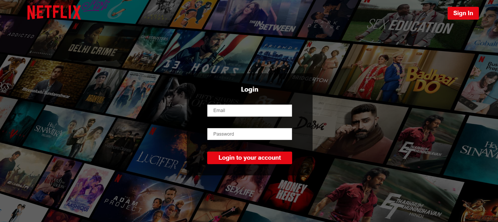
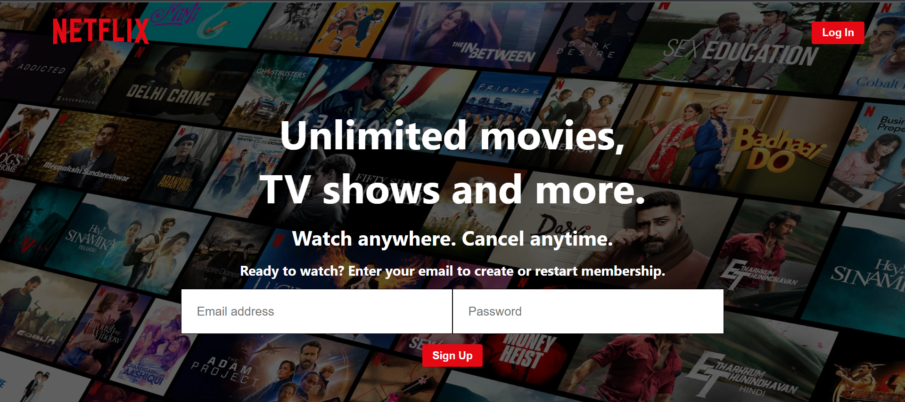
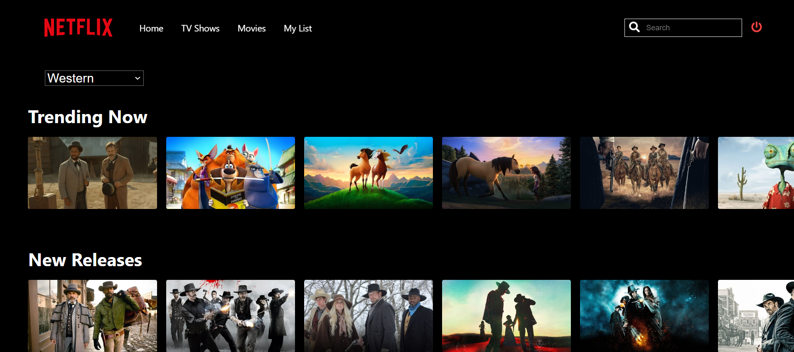
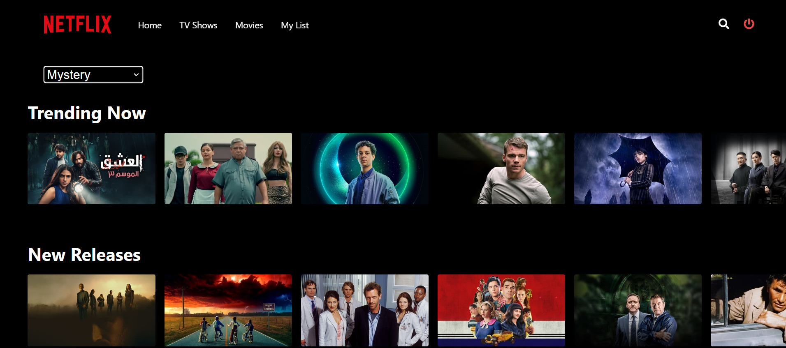

# netflix-clone-react
<a name="readme-top"></a>
<!--
*** Thanks for checking out the Netflix-Clone Project. If you have a suggestion
*** that would make this better, please fork the repo and create a pull request
*** or simply open an issue with the tag "enhancement".
*** Don't forget to give the project a star!
*** Thanks again! Now go create something AMAZING! :D
-->


<!-- ABOUT THE PROJECT -->
## About The Project

Here are previews of all the pages in the project.


<p>Login Page</p>

<p>Sigun-Up Page</p>

<p>Home Page</p>

<p>Movie Shows Page</p>

<p>Tv Shows Page</p>


<p align="right">(<a href="#readme-top">back to top</a>)</p>


### Built With

Here is the list of all the frameworks that have been used to develop these project.


* [![React][React.js]][React-url]
* [![MongoDb][MongoDb.com]][MongoDb-url]
* [![Redux][Redux.com]][Redux-url]
* [![NodeJs][NodeJs.com]][NodeJs-url]

<p align="right">(<a href="#readme-top">back to top</a>)</p>


<!-- GETTING STARTED -->
## Getting Started


Here are all the instructions for setting up project locally.Run these steps accordingly for local copy up.

### Prerequisites

Installation of the software
* npm
  ```sh
  npm install npm@latest -g
  ```

### Installation


Guidance for installation and setting on the app.

1. Clone the repo
   ```sh
   git clone  https://github.com/koyenapa/netflix-clone-react.git
   ```
2. Install NPM packages
   ```sh
   npm install
   ```


<p align="right">(<a href="#readme-top">back to top</a>)</p>


<!-- CONTRIBUTING -->
## Contributing

Contributions are what make the open source community such an amazing place to learn, inspire, and create. Any contributions you make are **greatly appreciated**.

If you have a suggestion that would make this better, please fork the repo and create a pull request. You can also simply open an issue with the tag "enhancement".
Don't forget to give the project a star! Thanks again!

1. Fork the Project
2. Create your Feature Branch (`git checkout -b feature/AmazingFeature`)
3. Commit your Changes (`git commit -m 'Add some AmazingFeature'`)
4. Push to the Branch (`git push origin feature/AmazingFeature`)
5. Open a Pull Request

<p align="right">(<a href="#readme-top">back to top</a>)</p>


<!-- LICENSE -->
## License

Distributed under the MIT License. See `LICENSE.txt` for more information.

<p align="right">(<a href="#readme-top">back to top</a>)</p>


<!-- CONTACT -->
## Contact

Koyena Paul - koyenapaul023@gmail.com

Project Link:  https://github.com/koyenapa/netflix-clone-react.git

<p align="right">(<a href="#readme-top">back to top</a>)</p>


<!-- ACKNOWLEDGMENTS -->
## Acknowledgments


Here is a list of few resources which I have found helpful and would like to give credit to.

* [Choose an Open Source License](https://choosealicense.com)
* [GitHub Emoji Cheat Sheet](https://www.webpagefx.com/tools/emoji-cheat-sheet)
* [Malven's Flexbox Cheatsheet](https://flexbox.malven.co/)
* [Malven's Grid Cheatsheet](https://grid.malven.co/)
* [Img Shields](https://shields.io)
* [GitHub Pages](https://pages.github.com)
* [Font Awesome](https://fontawesome.com)
* [React Icons](https://react-icons.github.io/react-icons/search)

<p align="right">(<a href="#readme-top">back to top</a>)</p>


<!-- MARKDOWN LINKS & IMAGES -->

[Next.js]: https://img.shields.io/badge/next.js-000000?style=for-the-badge&logo=nextdotjs&logoColor=white
[Next-url]: https://nextjs.org/
[React.js]: https://img.shields.io/badge/React-20232A?style=for-the-badge&logo=react&logoColor=61DAFB
[React-url]: https://reactjs.org/

[MongoDb.com]: https://img.shields.io/badge/MongoDB-4EA94B?style=for-the-badge&logo=mongodb&logoColor=white
[MongoDb-url]: https://www.mongodb.com/
[Redux.com]: https://img.shields.io/badge/Redux-593D88?style=for-the-badge&logo=redux&logoColor=white
[Redux-url]: https://redux.js.org/
[NodeJS.com]: https://img.shields.io/badge/Node.js-43853D?style=for-the-badge&logo=node.js&logoColor=white
[NodeJS-url]: https://nodejs.org/en
